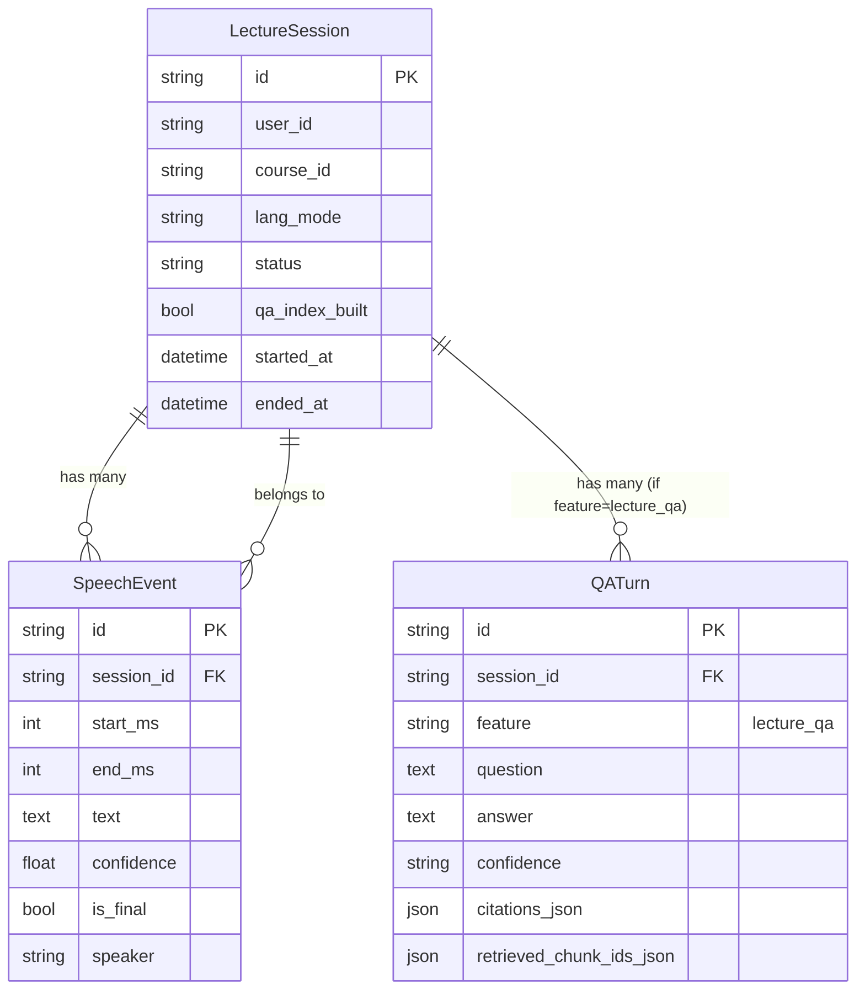

# F4 Lecture QA Codebase Analysis

**Generated**: 2026-02-21
**Purpose**: Analyze existing patterns for F4 Lecture QA implementation

---

## 1. Current Architecture & Patterns

### 1.1 Layer Architecture
```
┌─────────────────────────────────────────────────────────────┐
│  API Layer (app/api/v4/)                                     │
│  - lecture.py: Session lifecycle + speech chunk ingestion    │
│  - procedure.py: QA orchestration (retrieval + answer)       │
├─────────────────────────────────────────────────────────────┤
│  Service Layer (app/services/)                               │
│  - lecture_live_service.py: Protocol + SQLAlchemy impl       │
│  - procedure_qa_service.py: QA orchestration + persistence   │
│  - procedure_retrieval_service.py: Retrieval Protocol        │
│  - procedure_answerer_service.py: Answerer Protocol          │
├─────────────────────────────────────────────────────────────┤
│  Model Layer (app/models/)                                   │
│  - lecture_session.py: LectureSession ORM                    │
│  - speech_event.py: SpeechEvent ORM (FK to session)          │
│  - qa_turn.py: QATurn ORM (feature-tagged history)           │
├─────────────────────────────────────────────────────────────┤
│  Schema Layer (app/schemas/)                                 │
│  - lecture.py: Request/response models with validation       │
│  - procedure.py: ProcedureAskRequest/Response + Source       │
└─────────────────────────────────────────────────────────────┘
```

### 1.2 API Pattern (lecture.py)
- **Router**: `APIRouter(prefix="/lecture", tags=["lecture"])`
- **Auth**: `Depends(require_lecture_token)` + `require_user_id`
- **Service injection**: Function-based dependency provider
- **Error mapping**: Service exceptions → HTTP status codes
- **Response**: Direct service return (no transformation layer)

### 1.3 Service Layer Pattern
- **Protocol interface**: `class XxxService(Protocol)` for DI
- **SqlAlchemy impl**: `class SqlAlchemyXxxService` with `db: AsyncSession`
- **Custom exceptions**: Domain-specific (e.g., `LectureSessionNotFoundError`)
- **Persistence**: `self._db.add()` + `await self._db.flush()`

### 1.4 QA Service Pattern (procedure_qa_service.py)
- **Orchestration**: `retriever.retrieve()` → `answerer.answer()` → `_persist_turn()`
- **No-source guard**: Returns fallback before calling answerer
- **Metrics**: `perf_counter()` for latency tracking
- **Persistence**: Creates `QATurn` with `feature="procedure_qa"`

---

## 2. Reusable Components for F4

### 2.1 Models (Directly Reusable)
| Model | Field | Reuse for F4 |
|-------|-------|--------------|
| `LectureSession` | `id`, `user_id`, `course_id`, `lang_mode`, `status`, `qa_index_built` | ✅ Session context |
| `SpeechEvent` | `session_id`, `start_ms`, `end_ms`, `text`, `confidence`, `is_final`, `speaker` | ✅ Source for lecture chunks |
| `QATurn` | `session_id`, `feature`, `question`, `answer`, `confidence`, `citations_json`, `retrieved_chunk_ids_json` | ✅ Use `feature="lecture_qa"` |

### 2.2 Schemas (Adaptable)
| Schema | Adapt for F4 |
|--------|--------------|
| `ProcedureAskRequest` | Rename → `LectureAskRequest`, add `session_id` field |
| `ProcedureAskResponse` | Reuse `ProcedureSource` pattern with lecture-specific fields |
| `ProcedureSource` | Rename → `LectureSource`, add `timestamp_ms` for speech citation |

### 2.3 Service Protocols (Template)
```python
# Pattern from procedure_retrieval_service.py
class LectureRetrievalService(Protocol):
    async def retrieve(
        self, query: str, session_id: str, limit: int = 3
    ) -> list[LectureSource]:
        """Retrieve speech events relevant to the query."""
        ...
```

### 2.4 API Endpoint Pattern
```python
# Direct adaptation from procedure.py
@router.post(
    "/lecture/ask",
    status_code=status.HTTP_200_OK,
    response_model=LectureAskResponse,
)
async def ask_lecture(
    request: LectureAskRequest,
    service: Annotated[LectureQAService, Depends(get_lecture_qa_service)],
) -> LectureAskResponse:
    return await service.ask(request)
```

---

## 3. Missing Pieces for F4

### 3.1 New Models Needed
| Missing | Purpose |
|---------|---------|
| `LectureChunk` | Aggregated speech events per session for retrieval |
| `LectureIndexStatus` | Track `qa_index_built` state (already in `LectureSession.qa_index_built`) |

### 3.2 New Services Needed
| Service | Responsibility |
|---------|---------------|
| `lecture_retrieval_service.py` | Query `SpeechEvent` by `session_id`, rank by relevance |
| `lecture_answerer_service.py` | Generate answers from lecture contexts (reuse `ProcedureAnswererService` pattern) |
| `lecture_qa_service.py` | Orchestrate retrieval + answer + persist (reuse `procedure_qa_service.py` pattern) |

### 3.3 New Schemas Needed
| Schema | Fields |
|--------|--------|
| `LectureAskRequest` | `session_id`, `query`, `lang_mode` |
| `LectureAskResponse` | `answer`, `confidence`, `sources`, `action_next`, `fallback` |
| `LectureSource` | `event_id`, `text`, `start_ms`, `end_ms`, `speaker`, `timestamp_ms` |

### 3.4 Index Building (F4.1)
- **Endpoint**: `POST /lecture/qa/index/build`
- **Logic**: Aggregate `SpeechEvent.text` per session into searchable chunks
- **Flag**: Set `LectureSession.qa_index_built = True` when complete

---

## 4. Data Model Relationships



### 4.1 Retrieval Flow
1. Query `SpeechEvent` by `session_id`
2. Filter by `is_final=True` (only finalized chunks)
3. Rank by text relevance (BM25 or semantic)
4. Return top N as `LectureSource[]`

### 4.2 QA Persistence
- Use `QATurn.feature = "lecture_qa"` to distinguish from `procedure_qa`
- Store `session_id` to associate with lecture session
- Store `retrieved_chunk_ids_json` as list of `SpeechEvent.id`

---

## 5. Dependencies Status

### 5.1 Current (pyproject.toml)
```toml
dependencies = [
    "fastapi>=0.110",
    "pydantic-settings>=2.13.1",
    "uvicorn[standard]>=0.32",
    "sqlalchemy[asyncio]>=2.0",
    "aiosqlite>=0.21.0",
]
```

### 5.2 Missing for F4
| Dependency | Purpose | Priority |
|------------|---------|----------|
| `azure-search-documents` | Azure AI Search integration | F4.2 (later) |
| `rank-bm25` | Local BM25 ranking for MVP retrieval | F4.1 (now) |

### 5.3 Azure Integration Readiness
- **Status**: Provisioned but NOT integrated
- **Resources created**: Search, Speech, Vision, OpenAI, Storage
- **Bootstrap file**: `.env.azure.generated` (contains keys)
- **Config location**: `app/core/config.py` needs Azure keys added
- **Approach**: Implement fake retrieval first (like `FakeProcedureRetrievalService`), wire Azure later

---

## 6. Test Patterns

### 6.1 API Test Structure (test_lecture.py)
```python
# Pattern: Create session first, then test dependent endpoint
async def test_post_lecture_speech_chunk_returns_200_and_persists(...):
    # Arrange: Start session
    start_response = await async_client.post("/api/v4/lecture/session/start", ...)
    session_id = start_response.json()["session_id"]
    
    # Act: Call endpoint with session_id
    response = await async_client.post("/api/v4/lecture/speech/chunk", ...)
    
    # Assert: Check response + DB persistence
    assert response.status_code == 200
    async with session_factory() as session:
        result = await session.execute(select(SpeechEvent).where(...))
        speech_event = result.scalar_one_or_none()
    assert speech_event is not None
```

### 6.2 Error Cases Covered
- 401: Missing auth token
- 400: Validation errors (time range, consent)
- 404: Unknown session
- 409: Inactive session

### 6.3 Unit Test Structure
- `tests/unit/schemas/test_lecture_schemas.py`: Schema validation
- `tests/unit/services/test_lecture_live_service.py`: Service logic
- Pattern: Use `db_session` fixture for unit tests, `async_client` for integration

---

## 7. Implementation Strategy for F4

### Phase 1: F4.1 Lecture QA (Fake Retrieval)
1. Create `app/schemas/lecture_qa.py` (adapt from `procedure.py`)
2. Create `app/services/lecture_retrieval_service.py` (BM25 on SpeechEvent.text)
3. Create `app/services/lecture_answerer_service.py` (fake or reuse pattern)
4. Create `app/services/lecture_qa_service.py` (orchestration + QATurn persistence)
5. Add `POST /lecture/ask` endpoint to `app/api/v4/lecture.py`
6. Write tests (API + service + schema)

### Phase 2: F4.2 Index Building
1. Add `POST /lecture/qa/index/build` endpoint
2. Implement chunk aggregation logic
3. Set `qa_index_built` flag on completion

### Phase 3: F4.3 Azure Integration (Later)
1. Add Azure Search SDK to `pyproject.toml`
2. Create `AzureLectureRetrievalService` implementing protocol
3. Switch via DI in dependency provider

---

## 8. Key Decisions Reference

| Decision | Rationale |
|----------|-----------|
| Use `QATurn.feature = "lecture_qa"` | Single table for all QA history, filtered by feature |
| Speech events as retrieval source | Text is already transcribed, no extra processing needed |
| BM25 for MVP retrieval | Simple, deterministic, no Azure dependency for F4.1 |
| Protocol-based service interfaces | Enables fake implementation for TDD, Azure swap later |
| Session-scoped QA | Lecture questions only valid within active session context |
