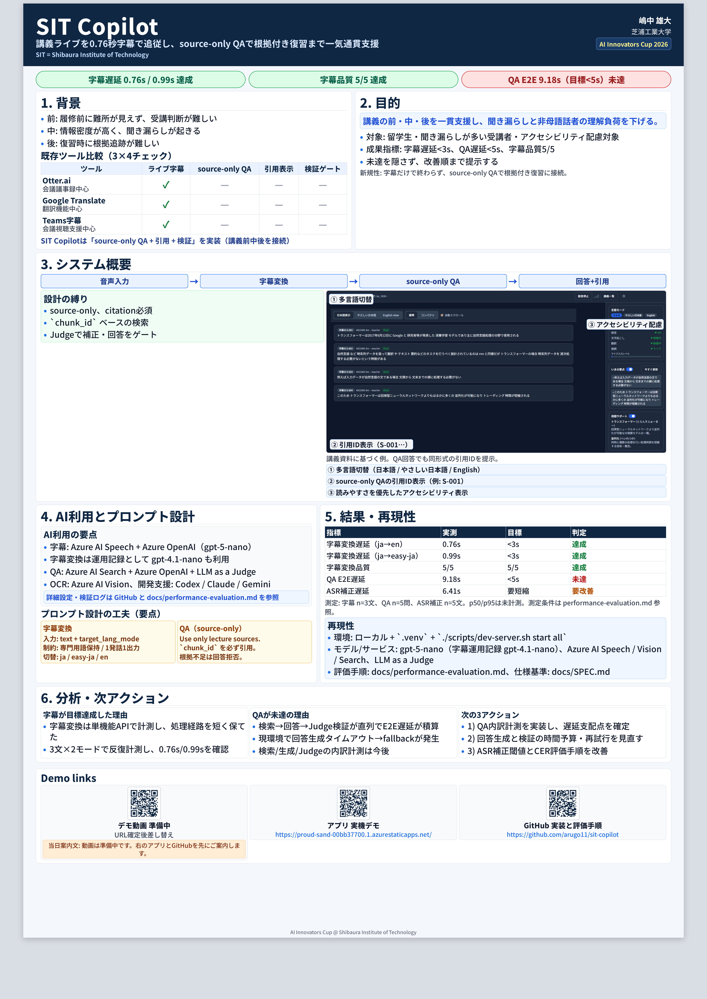

# SIT Copilot

SIT Copilot は、講義中の理解を支援することにフォーカスしたアプリです。現行実装では、セッション管理付きのライブ字幕表示、言語切り替え、要点/用語サポート、根拠付きミニ質問 QA、設定保存を中心に構成されています。

## 技術スタック

- Backend: FastAPI / Python
- Frontend: React + Vite + TypeScript

## 現在の実装に合わせた機能紹介

`frontend/src/app/router.tsx` の現行ルーティングに基づく機能です。

### 現在有効な導線

- `/`
  - ランディング画面。講義一覧 (`/lectures`) への導線を提供。
- `/lectures`
  - セッション開始、一覧表示、セッション終了、セッション削除。
  - セッション一覧はローカル保存 (`localStorage`) と同期。
- `/lectures/:id/live`
  - リアルタイム字幕表示。
  - 表示言語切り替え (`ja` / `easy-ja` / `en`)。
  - 翻訳フォールバック表示。
  - 要点サポート/用語サポート（トグルあり）。
  - 右ペインのミニ質問で根拠付き QA。
- `/settings`
  - テーマ、文字サイズ、字幕密度、自動スクロール、UI 言語、低モーション設定。
- `/lectures/:id/sources`
  - ソース一覧画面。現在はモックデータ表示。

### リダイレクト導線（現在は `/lectures` へ遷移）

- `/readiness-check`
- `/procedure`
- `/lectures/:id/qa`
- `/lecture/:session_id/qa`
- `/lectures/:id/review`

## ローカルでビルドする方法（Backend + Frontend）

### 前提条件

- Python 3.11+
- `uv`
- Node.js 20+
- `npm`

### クイック起動（推奨）

起動・停止・再起動は `scripts/dev-server.sh` でまとめて実行できます。

```bash
# Backend + Frontend を起動
./scripts/dev-server.sh start all

# 状態確認
./scripts/dev-server.sh status all

# Backend だけ再起動
./scripts/dev-server.sh restart backend

# 停止
./scripts/dev-server.sh stop all
```

- ログ確認:
  - `./scripts/dev-server.sh logs backend`
  - `./scripts/dev-server.sh logs frontend`
- デフォルトでは `WEAVE_ENABLED=false` で Backend を起動します。
  - Weave を有効にしたい場合: `WEAVE_ENABLED=true ./scripts/dev-server.sh start backend`
- PID/ログは `.runtime/` 配下に保存されます。

### 1. Backend の依存解決

```bash
uv sync --frozen --all-extras
```

### 2. （手動）Backend の起動確認

```bash
uv run uvicorn app.main:app --host 127.0.0.1 --port 8000
```

### 3. （手動）Frontend の依存解決とビルド

```bash
npm ci --prefix frontend
npm run build --prefix frontend
```

### 4. （手動）Frontend 開発起動

```bash
npm run dev --prefix frontend
```

- 開発時は `/api` が `127.0.0.1:8000` にプロキシされます。

## デプロイされている URL

- Frontend (Azure Static Web Apps / Azure for Students): `https://nice-hill-0533f2700.2.azurestaticapps.net/`
- Backend API (Azure Container Apps / Azure for Students): `https://sit-copilot-api.grayground-578aed68.japaneast.azurecontainerapps.io/`
- 確認コマンド:
  `az staticwebapp show -n sit-copilot-students -g sit-copilot --query defaultHostname -o tsv`
- 配信確認:
  `curl -I https://nice-hill-0533f2700.2.azurestaticapps.net/`
- API 確認:
  `curl https://sit-copilot-api.grayground-578aed68.japaneast.azurecontainerapps.io/api/v4/health`
- 現在の状態: 2026-03-12 時点で frontend / backend ともに疎通確認済み
- 運用メモ: 公開 frontend の lecture/procedure token と `X-User-Id` は
  Azure Static Web Apps の runtime 設定ではなく build-time に埋め込みます。
- token ローテーション時は Container Apps secret 更新後に
  frontend を再ビルドして SWA を再デプロイしてください。
- 講義ライブの時刻は epoch milliseconds を正式仕様としています。PostgreSQL 本番では
  `speech_events` / `summary_windows` / `lecture_chunks` / `visual_events` の
  時刻列が `BIGINT` である必要があります。
- `speech/chunk` が失敗した場合は、認証だけでなく Container Apps logs 上の
  DB write path も先に確認してください。
- 最終確認日: 2026-03-12 (JST)

## ポスター

- A0 PDF: [SIT_Copilot_Poster.pdf](poster-gen/SIT_Copilot_Poster.pdf)



2026-03-12 時点の運用記録に基づいています。更新時は `/.claude/docs/DESIGN.md` を参照してください。

## 補足リンク

- 実装仕様: `docs/SPEC.md`
- フロント設計: `docs/frontend.md`
- デモ運用: `docs/DEMO_RUNBOOK.md`
